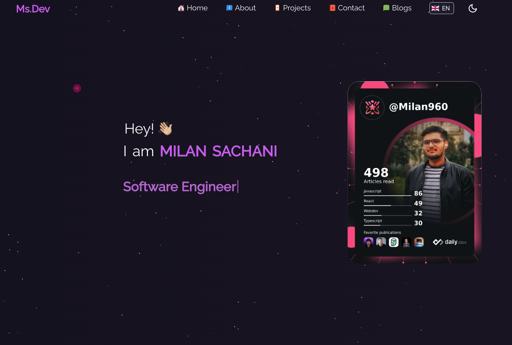
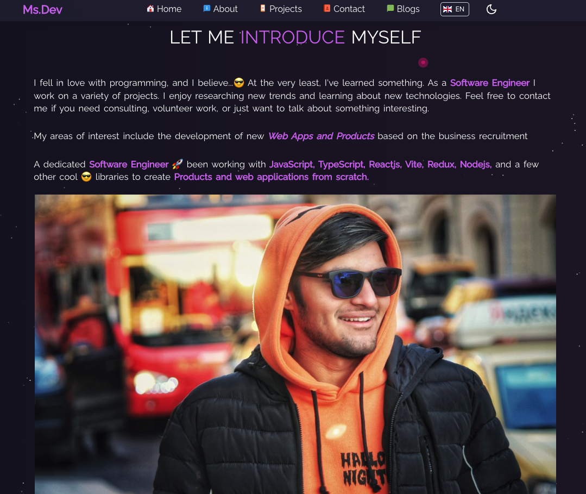

# [Live App 🔥](https://milansachani.dev/) || Myportfolio 🧑‍💻

### For clone this repository in your machine pest below link in your terminal 👇

```
git clone https://github.com/Milan-960/Myportfolio.git
```

### Run below code to install dependency

```
npm install
```

### Run npm start to run the app

```
npm start
```

### Tecnologias which have been used 🔥

- [ReactJS](https://reactjs.org/)
- [React Dom](https://reactjs.org/docs/react-dom.html)
- [React-Router-Dom](https://reactrouter.com/web/guides/quick-start)
- [MaterialUI](https://mui.com/)
- [I18n](https://www.i18next.com/)

&nbsp;
&nbsp;

&nbsp;
